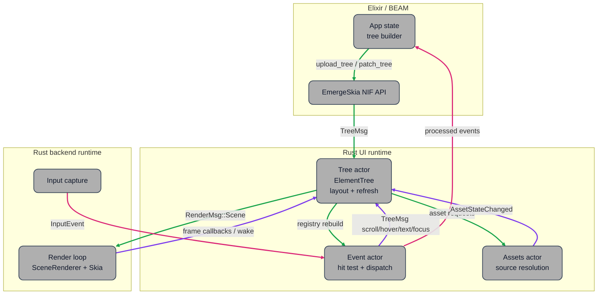

# Architecture

EmergeSkia is the native renderer, layout engine, event system, and backend
runtime used by Emerge. Elixir owns application state and encodes UI trees into
EMRG. Rust owns the decoded tree, layout, render-scene construction, event
hit-testing metadata, assets, text editing state, and backend rendering.

## System Shape

The runtime is split into three ownership areas:

- Elixir/BEAM builds app state, uploads or patches EMRG trees, and receives
  processed UI events.
- Rust UI runtime owns `ElementTree`, layout/refresh, input registry, asset
  resolution, text editing, and animation sampling.
- Rust backend runtime owns window or framebuffer integration, Skia surfaces,
  render submission, native input capture, cursors, and IME integration.



## Runtime Threads

Windowed and DRM runs use long-lived native threads:

| Thread or actor | Owns | Communicates with |
|-----------------|------|-------------------|
| Tree actor | `TreeUpdateEngine`, `ElementTree`, cached registry rebuild, animation runtime | Event actor, render queue, assets actor, backend wake |
| Event actor | Event registry, hit testing, cursor decisions, scroll/text/focus dispatch | Tree actor and Elixir process |
| Backend render loop | Skia surface/context, `SceneRenderer`, renderer paint-layer cache | Render queue and backend compositor/presenter |
| Backend input capture | Native pointer/keyboard/touch events | Event actor |
| Assets actor | Source path resolution and async asset state | Tree actor |
| Heartbeat/stats | Running state and optional renderer stats logging | Runtime resource |

`RenderSender` keeps only the latest pending render scene. If the bounded render
queue is full, an older scene can be dropped and pipeline timing metadata is
carried forward to the replacement scene.

`BackendWakeHandle` lets the tree and event actors request backend work without
knowing whether the backend is Wayland, DRM, macOS, raster, or a test no-op.

## Data Ownership

Elixir owns declared UI state. Rust owns runtime state derived from it.

`ElementTree` stores:

- stable node ids and topology
- declared attrs from EMRG patches/uploads
- `layout.effective`, the frame attrs used by layout and render
- layout frames, render frames, measured frames, scroll extents, and paragraph
  fragments
- runtime state for hover, mouse down, focus, text input, sliders, scrollbars,
  and nearby mounts
- layout caches, registry caches, retained render-layer scene caches, and dirty
  flags

Render backends receive `RenderScene` values. They do not read or mutate
`ElementTree`.

## Tree Update Pipeline

The Rust tree actor receives `TreeMsg` batches. `TreeUpdateEngine` flattens the
batch, applies tree mutations, samples animations, prepares effective attrs, and
decides the cheapest valid output action.

```text
TreeMsg batch
  -> decode upload or patch
  -> apply input/runtime state
  -> join TreeInvalidation values
  -> prepare frame attrs when needed
  -> decide refresh action
     -> Skip
     -> RegistryUpdate
     -> RefreshOnly
     -> Recompute layout + refresh
```

The invalidation ladder is:

```text
None < Registry < Paint < Resolve < Measure < Structure
```

`Registry` and `Paint` can refresh without layout when a root frame exists.
`Resolve`, `Measure`, and `Structure` require layout recomputation.

The detailed traversal and cache behavior is documented in
[Layout, Refresh, Render, and Cache Flow](layout-refresh-render-flow.md).

## Layout and Refresh

Layout is organized as:

```text
prepare frame attrs
  -> measure
  -> resolve
  -> refresh
```

Frame attribute preparation copies declared attrs into `layout.effective`,
applies scale, overlays animation samples, applies interaction styles, and marks
layout/render/registry damage. Full preparation walks the flat tree; refresh-only
runtime and `SetAttrs` updates use the same preparation code on only the touched
ids plus active animation ids. Scroll-only refresh skips frame-attr preparation
when no animation is active because scroll state already lives in layout state;
with active animations it prepares only the active animation ids.

The layout passes are:

- Measure: bottom-up intrinsic and subtree measurement.
- Resolve: top-down final placement, scroll extents, render frames, transformed
  layout-aware bounds, and nearby geometry.

Refresh converts the laid-out tree into:

- a `RenderScene` for the renderer
- an event registry rebuild when registry damage exists
- IME metadata and text state
- an animation-active flag

When the cached registry rebuild is clean, refresh skips registry traversal and
publishes only a render scene. Scroll damage rebuilds the registry because
hit-test geometry moves, but clean neutral branches are skipped with the
retained `registry_subtree_affects` prepass.

## Render Architecture

Render-scene construction is separate from Skia drawing:

```text
ElementTree
  -> tree/render.rs builds RenderScene
  -> backend render loop receives RenderMsg::Scene
  -> SceneRenderer traverses RenderNode tree
  -> Skia draw calls and paint-layer cache composition
  -> surface flush/present
```

`RenderScene` contains `RenderNode` values:

- primitive draw commands
- clip, relaxed clip, transform, alpha, and shadow-pass scopes
- paint layers

Paint layers are semantic composition boundaries. The renderer may cache a
paint layer payload, then compose it later with new placement or alpha if the
contents did not change. Nested paint layers are stored as child references so
stable children survive parent invalidation and redraw.

Renderer cache behavior is backend-neutral:

- GPU backends store GPU image payloads.
- Raster paths can store CPU payloads.
- A cache miss or bypass falls back to direct drawing without changing output.

## Event Architecture

Backends normalize native input into `InputEvent` values. The event actor uses
the latest event registry to hit-test and dispatch:

- pointer move, enter/leave, press, release, click, and wheel
- scrollbar hover and drag
- drag-scroll
- focus and blur
- text input editing, selection, clipboard shortcuts, and IME commits
- slider updates
- key events and virtual keys

Event outcomes either go back to Elixir as processed UI events, to the tree
actor as `TreeMsg` runtime changes, or to the backend as cursor updates.

The event actor does not perform layout. It requests tree changes and consumes
registry rebuilds from the tree actor.

## Backends

Supported backend families:

| Backend | Purpose | Rendering path |
|---------|---------|----------------|
| Wayland | Windowed Linux runtime | EGL/Skia GPU surface and Wayland frame callbacks |
| DRM | Direct Linux framebuffer/kiosk runtime | KMS/DRM presentation with Skia GPU surface |
| macOS | Host runtime integration | Native host protocol and Skia rendering integration |
| Raster | Offscreen/headless testing | CPU raster surface |

Backends consume `RenderMsg::Scene`, update `RenderState`, and call
`SceneRenderer`. They also forward native input to the event actor and expose a
wake handle for redraws.

## Assets and Fonts

The asset pipeline resolves source-based images after upload or patch. Loaded
assets are inserted into renderer-global asset caches, and the tree is notified
with `AssetStateChanged`.

Renderer-global caches include:

- font typeface cache
- image/video asset cache
- rendered vector variant cache
- Skia global caches

Font and asset generations participate in paint-layer payload keys so cached
payloads are invalidated when resource contents change.

See [Assets and Images](assets-images.md) for source resolution, runtime path
security, and async loading behavior.

## Scaling Architecture

Elements keep declared attrs separate from frame-effective attrs:

- Declared attrs are stored from EMRG uploads and patches in unscaled form.
- `layout.effective` is rebuilt for the current frame and scale.

Scale is applied during frame attr preparation from the declared values, not by
mutating already-scaled output. This prevents cumulative scale errors.

Scaled fields include:

- pixel widths and heights, including min/max wrappers
- padding
- spacing
- border radius and border width
- font size
- font letter and word spacing
- transform/layout-scale dependent frame attrs

Render and event code read `layout.effective` and layout frames. They do not
perform their own high-DPI scaling.

## Cache Layers

The architecture has several separate caches with different owners:

| Cache | Owner | Scope |
|-------|-------|-------|
| Layout measure caches | `ElementTree` node layout state | Intrinsic and subtree measurement reuse |
| Layout resolve cache | `ElementTree` node layout state | Final frame and geometry reuse |
| Registry subtree cache | `ElementTree` node refresh state | Event registry chunk reuse |
| Cached registry rebuild | `TreeUpdateEngine` | Whole clean registry response |
| Retained render-layer scene cache | `ElementTree` node refresh state | Reuse `RenderPaintLayer` scene fragments |
| Renderer paint-layer payload cache | `SceneRenderer` | GPU/CPU image payload reuse |
| Asset/font/vector caches | Renderer globals | Resource reuse and resource generations |

These caches are intentionally owned by the stage that can validate them. For
example, the tree can decide that a retained paint-layer scene fragment is still
semantically valid, but only the renderer can decide whether a concrete GPU
payload should be stored or reused.

## Module Structure

```text
native/emerge_skia/src/
  lib.rs                         NIF entry points, resource setup, runtime startup
  actors.rs                      Cross-actor message enums
  runtime/
    tree_actor.rs                Tree actor loop and render/event publication
    tree_update.rs               Batch processing and refresh decision
  tree/
    element.rs                   ElementTree, node state, dirty flags, caches
    attrs.rs                     Decoded attrs and style state
    deserialize.rs               EMRG decoder
    serialize.rs                 EMRG encoder used by tests/tools
    patch.rs                     Incremental tree patch application
    invalidation.rs              TreeInvalidation and refresh decision helpers
    animation.rs                 Animation runtime and frame samples
    layout.rs                    Frame attrs, measure, resolve, refresh
    render.rs                    ElementTree to RenderScene
    render/text.rs               Text render helpers
    scrollbar.rs                 Shared scrollbar geometry
  render_scene.rs                RenderScene, RenderNode, paint layers, primitives
  renderer.rs                    SceneRenderer, Skia drawing, renderer caches
  paint_layer_payload_cache.rs   Payload cache storage and eviction
  events.rs                      Event actor entry points and registry payloads
  events/
    registry_builder.rs          Event registry traversal and subtree cache
    scrollbar.rs                 Scrollbar hit and drag state
  assets.rs                      Asset actor and source resolution
  backend/
    wayland/                     Wayland input, EGL rendering, presentation, IME
    drm.rs                       Direct KMS/DRM backend
    macos/                       macOS host protocol integration
    raster.rs                    Offscreen CPU renderer
    wake.rs                      Backend wake abstraction
    skia_gpu.rs                  Shared Skia GPU helpers
```

Elixir-side entry points:

```text
lib/emerge_skia.ex               Public API
lib/emerge_skia/native.ex        Rustler NIF bindings
```

## Related Guides

- [Layout, Refresh, Render, and Cache Flow](layout-refresh-render-flow.md)
- [Tree Patching](tree-patching.md)
- [EMRG Format](emrg-format.md)
- [Assets and Images](assets-images.md)
- [Events](events.md)
- [Nearby Semantics](nearby-semantics.md)
- [BEAM Performance Constraints](beam-performance-constraints.md)
